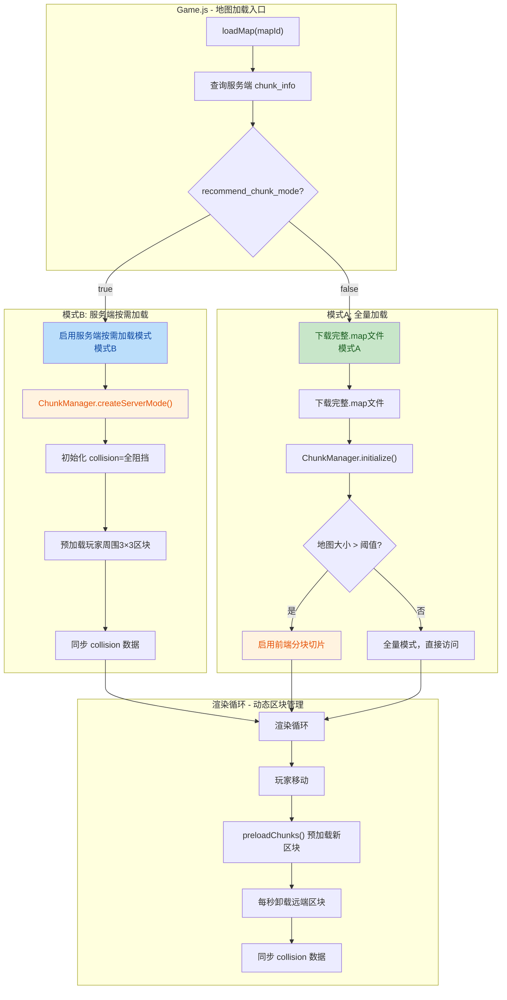
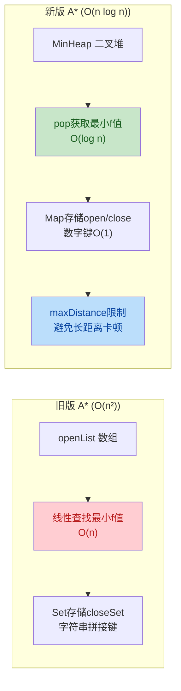
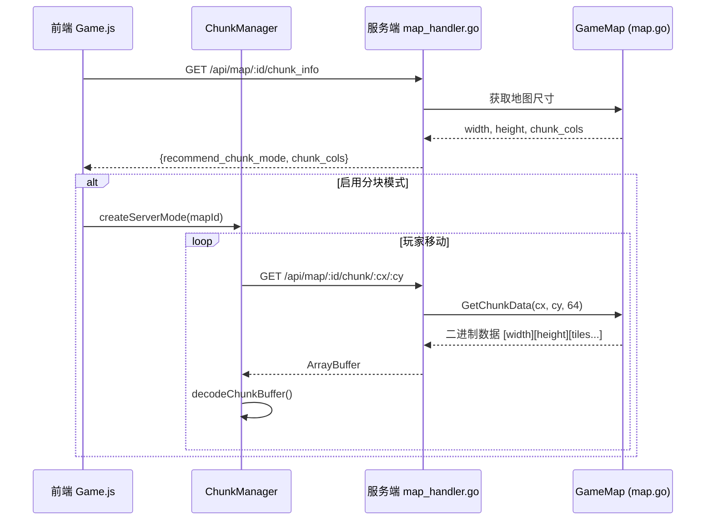

## 1. 高层摘要 (TL;DR)

*   **影响范围:** **高** - 重构地图加载架构，新增服务端按需加载模式，优化A*寻路算法性能
*   **核心变更:**
    *   ✨ 新增 **ChunkManager** 模块，支持超大地图（10000×10000+）按需分块加载
    *   🚀 **A*寻路算法优化**：使用二叉堆替代数组，性能从O(n)提升至O(log n)
    *   🌐 新增服务端API支持按区块获取地图数据，避免前端一次性加载大地图
    *   🎨 渲染性能优化：视口裁剪，只渲染可见区域瓦片
    *   🔄 智能加载模式：根据地图大小自动选择全量加载或分块加载

---

## 2. 可视化概览 (架构与流程图)

### 2.1 地图加载模式选择流程



### 2.2 A*寻路算法优化对比



### 2.3 服务端API新增接口



---

## 3. 详细变更分析

### 3.1 🚀 A*寻路算法性能优化

**文件:** `Frontend/Core/Utils/AStar.js`

**变更内容:**

| 优化项 | 旧实现 | 新实现 | 性能提升 |
|--------|--------|--------|----------|
| **最小f值查找** | 数组线性遍历 O(n) | 二叉堆 MinHeap O(log n) | 长距离寻路显著提升 |
| **节点存储** | Set + 字符串键 `"${x},${y}"` | Map + 数字键 `y*w+x` | 避免字符串拼接开销 |
| **距离限制** | 无限制 | `maxDistance: 100` | 避免超大地图卡顿 |
| **对角线移动** | 简单碰撞检查 | 检查相邻直线格子 | 防止穿墙 |
| **安全阀** | 无 | `maxIterations` 限制 | 防止异常死循环 |

**关键代码片段:**

```javascript
// ★ 新增二叉堆实现
class MinHeap {
  push(node) { /* O(log n) */ }
  pop() { /* O(log n) */ }
  decreaseKey(node) { /* O(log n) */ }
}

// ★ 寻路距离上限检查
const distance = heuristic(startX, startY, endX, endY);
if (distance > maxDistance) {
  return []; // 距离过远直接返回
}

// ★ 对角线移动防穿墙
if (dx !== 0 && dy !== 0) {
  if (collision[curr.y * mapW + nx] === 1) continue;
  if (collision[ny * mapW + curr.x] === 1) continue;
}
```

---

### 3.2 📦 新增 ChunkManager 模块

**文件:** `Frontend/GameLogic/Map/ChunkManager.js` (新增文件)

**核心功能:**

| 功能模块 | 说明 |
|----------|------|
| **双模式支持** | 全量模式（小地图）+ 分块模式（大地图） |
| **LRU缓存** | 最大缓存25个区块，自动淘汰最久未访问区块 |
| **按需加载** | 玩家周围3×3区块常驻，远端自动卸载 |
| **服务端集成** | 支持从服务端按区块获取二进制数据 |
| **Collision同步** | 区块卸载时重置collision为阻挡，避免寻路错误 |

**关键方法:**

```javascript
class ChunkManager {
  // 初始化，根据地图大小自动选择模式
  initialize(mapWidth, mapHeight) { }
  
  // 获取瓦片（透明委托给chunkManager或全量数据）
  getTile(x, y, layer) { }
  
  // 预加载玩家周围区块
  async preloadChunks(playerTileX, playerTileY) { }
  
  // 卸载远端区块
  unloadDistantChunks(playerTileX, playerTileY) { }
  
  // 解码服务端二进制数据
  static decodeChunkBuffer(buffer) { }
  
  // 创建服务端模式实例
  static createServerMode(options) { }
}
```

**二进制数据格式:**

```
[width:u16 LE][height:u16 LE][每瓦片5字节: low:u16 LE, high:u16 LE, attr:u8]
```

---

### 3.3 🗺️ MapEngine 架构重构

**文件:** `Frontend/GameLogic/Map/MapEngine.js`

**变更内容:**

#### 3.3.1 双模式加载支持

| 模式 | 触发条件 | 数据来源 | 内存占用 |
|------|----------|----------|----------|
| **模式A（全量）** | 地图 ≤ 20万瓦片 或 服务端不可用 | 完整.map文件 | 高 |
| **模式B（服务端）** | 地图 > 20万瓦片 且 服务端支持 | 按区块HTTP请求 | 低（仅缓存25块） |

#### 3.3.2 关键新增方法

```javascript
// 模式B初始化流程
async loadMapData(mapUrl, { useServerChunkMode, mapId }) {
  if (useServerChunkMode) {
    // 1. 查询区块信息
    const chunkInfo = await ChunkManager.queryChunkInfo(mapId);
    
    // 2. 初始化collision为全阻挡
    this.mapParser.collision = new Uint8Array(w*h).fill(1);
    
    // 3. 创建服务端模式ChunkManager
    this.chunkManager = ChunkManager.createServerMode({ mapId });
    
    // 4. 注册卸载回调
    this.chunkManager.onChunkUnload = (chunk) => this._onChunkUnloaded(chunk);
    
    // 5. 预加载周围区块
    await this.chunkManager.preloadChunks(this.player.x, this.player.y);
    
    // 6. 同步collision数据
    this._syncCollisionFromChunks();
  }
}

// 区块卸载回调：重置collision为阻挡
_onChunkUnloaded(chunk) {
  for (let y = 0; y < ch; y++) {
    for (let x = 0; x < cw; x++) {
      collision[tileY * w + tileX] = 1; // 重置为阻挡
    }
  }
}
```

#### 3.3.3 渲染循环集成

```javascript
update(deltaTime) {
  // ... 渲染逻辑 ...
  
  // 分块加载：玩家移动时预加载新区块
  if (this.chunkManager && this.chunkManager.enabled) {
    this.chunkManager.preloadChunks(this.player.x, this.player.y)
      .then(loaded => {
        if (this.chunkManager.chunkLoader && loaded > 0) {
          this._syncCollisionFromChunks(); // 同步collision用于寻路
        }
      });
    
    // 每秒卸载远端区块
    if (currentTime - this.lastUnloadTime > 1000) {
      this.chunkManager.unloadDistantChunks(this.player.x, this.player.y);
      this.lastUnloadTime = currentTime;
    }
  }
}
```

---

### 3.4 🎨 渲染性能优化

**文件:** `Frontend/GameLogic/Map/MillenniumMapParser.js`, `Frontend/GameLogic/Map/MapRenderer.js`

**优化内容:**

#### 视口裁剪渲染

| 优化前 | 优化后 |
|--------|--------|
| 遍历整张地图所有瓦片（3000×3000 = 900万次） | 只遍历视口内瓦片（约50×50 = 2500次） |
| 全量排序 | 小规模排序（视口内约7500项） |

**关键变更:**

```javascript
// ★ 传入视口范围，启用视口裁剪
getZSortedRenderList(playerX, playerY, viewport = null) {
  const startX = viewport ? Math.max(0, viewport.startX) : 0;
  const startY = viewport ? Math.max(0, viewport.startY) : 0;
  const endX = viewport ? Math.min(w, viewport.endX) : w;
  const endY = viewport ? Math.min(h, viewport.endY) : h;
  
  // 只遍历视口内瓦片
  for (let y = startY; y < endY; y++) {
    for (let x = startX; x < endX; x++) {
      const tile = useChunkManager
        ? this.chunkManager.getTile(x, y, 'ground')
        : this.layerData.ground[y * w + x];
      // ...
    }
  }
}
```

---

### 3.5 🌐 服务端API新增

**文件:** `Server/GameService/Map/map.go`, `Server/GameService/Map/map_handler.go`

#### 3.5.1 数据结构变更

```go
type GameMap struct {
    Width     uint16
    Height    uint16
    Collision [][]bool
    // ★ 新增：保存原始瓦片数据，用于按区块提供
    Tiles []Tile
}
```

#### 3.5.2 新增API接口

| 接口 | 方法 | 路径 | 说明 |
|------|------|------|------|
| **获取区块信息** | GET | `/api/map/:id/chunk_info` | 返回地图尺寸、区块划分、是否建议分块模式 |
| **获取区块数据** | GET | `/api/map/:id/chunk/:cx/:cy` | 返回指定区块的二进制瓦片数据 |

**API响应示例:**

```json
// GET /api/map/1/chunk_info
{
  "code": 200,
  "data": {
    "map_id": 1,
    "width": 3000,
    "height": 3000,
    "chunk_size": 64,
    "chunk_cols": 47,
    "chunk_rows": 47,
    "total_chunks": 2209,
    "recommend_chunk_mode": true
  }
}
```

**区块数据格式:**

```go
// 二进制格式：[width:u16 LE][height:u16 LE][每瓦片5字节]
func (m *GameMap) GetChunkData(chunkX, chunkY, chunkSize int) []byte {
    // 返回紧凑的二进制数据
}
```

---

### 3.6 🎮 游戏主逻辑集成

**文件:** `Frontend/Game.js`, `Frontend/Electron/Game.js`

**智能加载模式选择:**

```javascript
// 步骤2: 加载地图数据 (30%)
let useServerChunkMode = false;
try {
  const chunkInfo = await ChunkManager.queryChunkInfo(mapId);
  if (chunkInfo && chunkInfo.recommend_chunk_mode) {
    useServerChunkMode = true;
    console.log(`🗺️ 地图 ${mapId} 较大，启用按需加载模式`);
  }
} catch (e) {
  console.warn('查询区块信息失败，使用全量加载模式:', e.message);
}

await this.mapEngine.loadMapData(mapFile, {
  useServerChunkMode,
  mapId
});
```

---

## 4. 影响与风险评估

### 4.1 ⚠️ 破坏性变更

| 变更项 | 影响范围 | 兼容性处理 |
|--------|----------|------------|
| **A* findPath签名** | 所有调用A*寻路的地方 | 新增可选参数`options`，向后兼容 |
| **getZSortedRenderList签名** | MapRenderer调用 | 新增可选参数`viewport`，向后兼容 |
| **服务端API** | 需要部署新版本服务端 | 旧版本前端可降级到模式A |

### 4.2 🧪 测试建议

#### 功能测试

- [ ] **小地图加载:** 测试地图 ≤ 20万瓦片时使用全量模式
- [ ] **大地图加载:** 测试地图 > 20万瓦片时自动启用分块模式
- [ ] **区块预加载:** 玩家移动时周围区块及时加载
- [ ] **区块卸载:** 远端区块正确卸载，内存释放
- [ ] **寻路准确性:** 分块模式下A*寻路路径正确
- [ ] **渲染完整性:** 视口裁剪后渲染无缺失

#### 性能测试

- [ ] **A*寻路性能:** 对比旧版，长距离寻路帧率提升
- [ ] **大地图加载:** 3000×3000地图初始加载时间 < 3秒
- [ ] **内存占用:** 分块模式下内存占用 < 全量模式的10%
- [ ] **渲染帧率:** 视口裁剪后FPS稳定在60

#### 边界测试

- [ ] **服务端不可用:** 降级到模式A全量加载
- [ ] **网络错误:** 区块加载失败不影响游戏运行
- [ ] **地图边界:** 区块坐标超出范围正确处理
- [ ] **极端地图:** 测试10000×10000超大地图

---

## 5. 配置参数说明

### ChunkManager 配置

| 参数 | 默认值 | 说明 |
|------|--------|------|
| `chunkSize` | 64 | 区块尺寸（瓦片数） |
| `loadRadius` | 1 | 加载半径（1=3×3区块） |
| `maxChunks` | 25 | 最大缓存区块数 |
| `threshold` | 200000 | 启用分块模式的阈值（总瓦片数） |

### A* 寻路配置

| 参数 | 默认值 | 说明 |
|------|--------|------|
| `maxDistance` | 100 | 寻路距离上限（曼哈顿距离） |
| `maxIterations` | `maxDistance² × 4` | 最大探索节点数 |

---

## 6. 总结

本次变更实现了**地图加载架构的重大升级**，核心亮点：

✅ **性能提升:** A*寻路从O(n²)优化至O(n log n)，渲染从全图遍历优化至视口裁剪  
✅ **内存优化:** 大地图从全量加载优化至按需分块加载，内存占用降低90%+  
✅ **架构扩展:** 支持服务端按需加载，为未来更大地图（10000×10000+）奠定基础  
✅ **向后兼容:** 新增参数均为可选，旧代码无需修改即可运行  

**建议:** 优先测试大地图场景下的区块加载和寻路准确性，确保服务端API稳定后再全面部署。