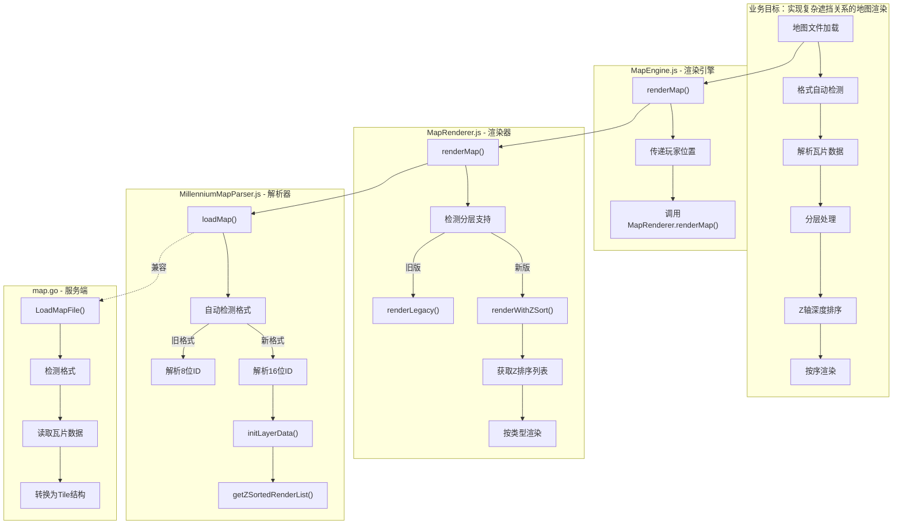
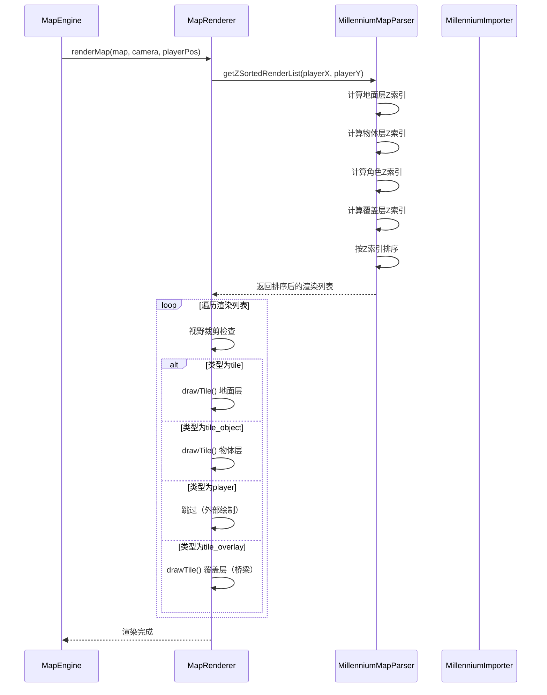

## 1. 高级摘要（TL;DR）

*   **影响范围：高** - 重构了整个地图渲染系统，涉及前端渲染引擎、地图解析器、编辑器和服务端地图加载
*   **核心变更：**
    *   ✨ 实现三层地图系统（地面层/物体层/覆盖层）支持复杂的遮挡关系
    *   🎨 引入Z轴深度排序渲染（Y-Sort算法），实现角色在桥下被遮挡等效果
    *   🔢 瓦片ID从8位升级到16位，支持0-65535范围的瓦片
    *   🎯 新增独立物体对象系统，支持动态物体管理
    *   🔄 实现新旧地图格式的自动检测和向后兼容

## 2. 可视化概述（代码与逻辑映射）





## 3. 详细变更分析

### 🎮 核心渲染系统

#### **MapEngine.js** - 渲染引擎更新
*   **变更内容：** 修改了地图渲染流程，传递玩家位置用于Z轴深度排序
*   **关键代码：**
    ```javascript
    // 新增：传递玩家位置给Z排序算法
    const playerPos = { x: this.player.x, y: this.player.y };
    this.mapRenderer.renderMap(
      this.mapParser,
      this.camera.offsetX,
      this.camera.offsetY,
      this.canvas.width,
      this.canvas.height,
      playerPos  // 新增参数
    );
    ```
*   **业务逻辑：** 确保角色在桥梁下方时会被正确遮挡，通过传递玩家坐标给渲染器进行深度排序

#### **MapRenderer.js** - 渲染器重构
*   **变更内容：** 完全重构渲染逻辑，支持三层地图系统和Z轴深度排序
*   **新增方法：**
    *   `renderWithZSort()` - 新版Z轴深度排序渲染
    *   `renderLegacy()` - 旧版兼容渲染器
    *   `renderLayer()` - 分层渲染（调试用）
    *   `renderObjectAnimation()` - 物体动画效果
*   **动画效果：** 新增火焰、水流、光源、魔法阵等视觉效果
*   **分层配置：**
    ```javascript
    this.layerRendering = {
      ground: true,     // 地面层
      object: true,     // 物体层
      overlay: true,    // 覆盖层（桥梁等）
      player: true      // 玩家
    };
    ```

#### **MillenniumMapParser.js** - 地图解析器升级
*   **变更内容：** 支持三层地图系统和16位瓦片ID
*   **新增属性：**
    ```javascript
    this.objects = [];        // 物体对象列表
    this.layerData = {        // 分层瓦片数据
      ground: [],             // Layer 0: 地面层
      object: [],             // Layer 1: 物体层
      overlay: []             // Layer 2: 覆盖层
    };
    ```
*   **核心方法：**
    *   `calculateZIndex()` - 计算Z轴索引（Y-Sort算法）
    *   `getZSortedRenderList()` - 获取Z排序后的渲染列表
    *   `isBlockedByOverlay()` - 检查是否被覆盖层遮挡
    *   `addObject/removeObject/moveObject()` - 物体管理

### 📊 数据格式变更

#### **瓦片数据结构对比**

| 组件 | 旧格式 | 新格式 | 说明 |
|------|--------|--------|------|
| **瓦片ID范围** | 0-255 (uint8) | 0-65535 (uint16) | 支持4倍更多瓦片 |
| **每瓦片字节数** | 3字节 | 5字节 | low(2) + high(2) + attr(1) |
| **图层系统** | 双层（low/high） | 三层（ground/object/overlay） | 支持复杂遮挡 |
| **物体对象** | 不支持 | 支持 | 独立物体管理 |
| **Z轴排序** | 简单分层 | Y-Sort深度排序 | 正确的遮挡关系 |

#### **地图文件格式**

| 偏移 | 字段 | 类型 | 说明 |
|------|------|------|------|
| 0x00-0x05 | Magic | char[6] | "MAPFILE" 标识 |
| 0x7C | tilesetCols | uint16 | 图集列数（偏移124） |
| 0x80 | width | uint16 | 地图宽度 |
| 0x82 | height | uint16 | 地图高度 |
| 0x84+ | tiles | 动态 | 瓦片数据（5字节/瓦片） |

### 🛠️ 编辑器功能增强

#### **MapEditor.html** - 地图编辑器
*   **新增UI组件：**
    *   图层管理面板（显示/隐藏各层）
    *   物体列表面板
    *   物体放置模式指示器
*   **图层选择：**
    ```html
    <select id="tileLayer">
      <option value="0">🟩 Layer 0: 地面层</option>
      <option value="1">🟧 Layer 1: 物体层</option>
      <option value="2">🟨 Layer 2: 覆盖层(桥/屋顶)</option>
    </select>
    ```
*   **关键修复：** 修复了图集列数计算逻辑，使用`Math.floor()`替代`Math.round()`避免瓦片错位

#### **CreateTileset.html** - 瓦片图集生成器
*   **新增属性：**
    *   瓦片图层选择（0/1/2）
    *   遮挡标记（isOverlay）
*   **元数据版本：** 升级到v2.0，标记支持分层系统
*   **验证逻辑：** 增加配置值有效性检查（瓦片尺寸16-128，列数1-32）

### 🔄 格式兼容性

#### **MillenniumImporter.js** - 导入器更新
*   **自动检测：** 通过文件大小自动判断新旧格式
*   **兼容逻辑：**
    ```javascript
    const expectedSizeNewFormat = 128 + 4 + total * 5;
    const expectedSizeOldFormat = 128 + 4 + total * 3;
    const isNewFormat = Math.abs(buffer.byteLength - expectedSizeNewFormat) <= 
                        Math.abs(buffer.byteLength - expectedSizeOldFormat);
    ```
*   **导出格式：** 统一使用新格式（16位ID + tilesetCols）

#### **map.go** - 服务端同步
*   **Tile结构更新：**
    ```go
    type Tile struct {
        Low  uint16 // 16位瓦片ID
        High uint16 // 16位瓦片ID
        Attr uint8  // 属性
    }
    ```
*   **格式检测：** 与前端保持一致的自动检测逻辑
*   **向后兼容：** 自动将8位ID转换为16位

### 🧪 测试文件

*   **syntax-check.html** - 语法验证工具
*   **test.html** - 基本功能测试页面

## 4. 影响与风险评估

### ⚠️ 破坏性变更

| 变更项 | 影响范围 | 兼容性处理 |
|--------|----------|------------|
| **瓦片ID升级到16位** | 所有地图文件 | ✅ 自动检测旧格式并兼容 |
| **地图文件格式变更** | 导出/导入流程 | ✅ 保留旧格式读取支持 |
| **渲染流程重构** | 自定义渲染逻辑 | ⚠️ 需要更新调用代码 |
| **Tile结构字段类型** | 服务端地图处理 | ✅ 自动类型转换 |

### 🧪 测试建议

#### **功能测试**
1. **遮挡关系测试：**
   - 创建包含桥梁的地图
   - 验证角色在桥下时被正确遮挡
   - 验证角色在桥上时正确显示在桥梁上方

2. **格式兼容性测试：**
   - 加载旧版8位ID地图文件
   - 加载新版16位ID地图文件
   - 验证导出的文件可被正确重新导入

3. **图层管理测试：**
   - 切换各图层可见性
   - 在不同图层绘制瓦片
   - 验证图层渲染顺序正确

4. **物体系统测试：**
   - 添加/删除/移动物体
   - 验证物体在渲染列表中的正确位置
   - 测试物体动画效果

#### **性能测试**
1. **大地图渲染：** 测试100x100以上地图的渲染性能
2. **Z排序性能：** 验证每帧重新排序的性能影响
3. **内存占用：** 检查三层系统对内存的影响

#### **边界测试**
1. **瓦片ID边界：** 测试ID=0、ID=65535等边界值
2. **空地图测试：** 验证空地图的渲染
3. **异常文件测试：** 测试损坏或不完整的地图文件

### 📝 迁移指南

#### **对于现有地图**
- ✅ 无需手动转换，系统自动兼容旧格式
- 💡 建议重新导出为新格式以获得完整功能

#### **对于自定义渲染代码**
- 🔄 更新`renderMap()`调用，传递`playerPos`参数
- 🔄 如有自定义渲染逻辑，参考新的`renderWithZSort()`实现

#### **对于服务端集成**
- ✅ 更新`Tile`结构体定义
- ✅ 重新编译服务端以支持新格式

---

**总结：** 此次更新实现了游戏地图系统的重大升级，通过三层渲染和Z轴深度排序解决了长期存在的遮挡关系问题。系统保持了良好的向后兼容性，现有地图文件无需修改即可正常工作。建议开发者重点关注遮挡关系的测试和性能优化。