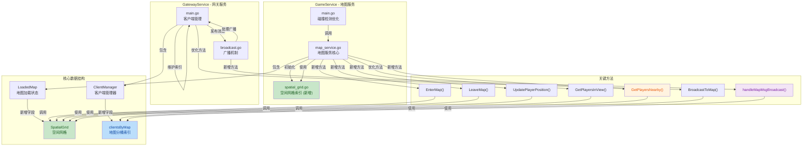
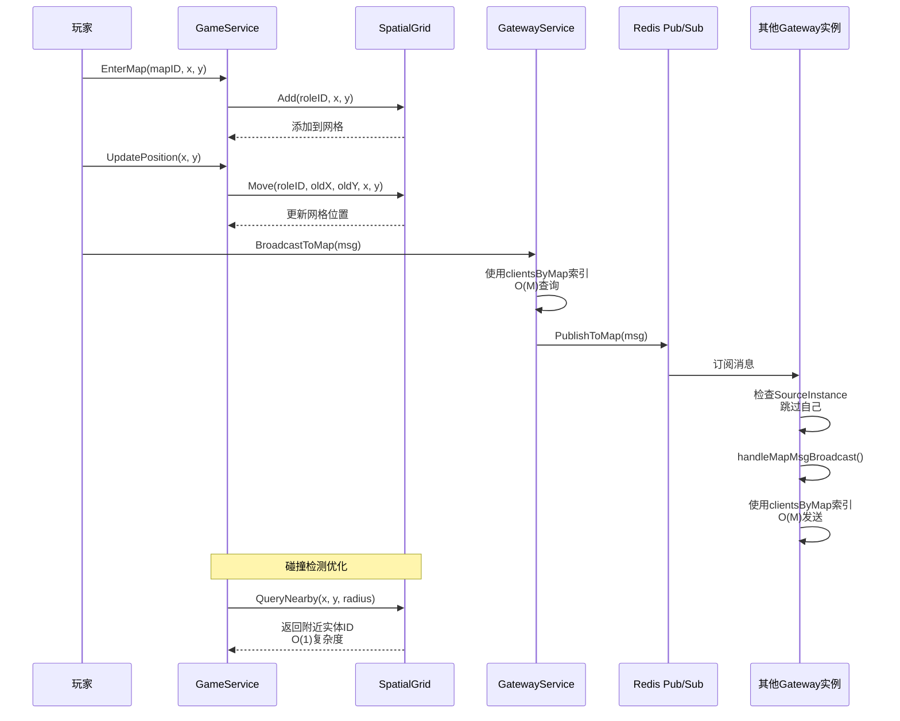

## 1. 高层摘要 (TL;DR)

*   **影响范围：** 🟢 **中等** - 性能优化与架构改进，涉及地图服务和网关服务的核心广播机制
*   **核心变更：**
    *   ✨ 新增 **空间网格索引** (`SpatialGrid`)，将碰撞检测复杂度从 **O(N)** 降至 **O(1)**
    *   ✨ 新增 **按地图分桶索引** (`clientsByMap`)，优化网关广播查询性能
    *   ✨ 支持 **多 Gateway 实例跨实例广播**，避免消息循环
    *   🔧 优化多个广播处理函数，使用索引替代全遍历

---

## 2. 可视化概览 (代码与逻辑映射)





---

## 3. 详细变更分析

### 🎮 组件一：GameService - 地图服务优化

#### 📁 `Server/GameService/Map/spatial_grid.go` (新增文件)

**变更说明：** 新增空间网格索引结构，用于加速碰撞检测和视野查询。

**核心特性：**
- 将地图划分为固定大小的格子（默认 `cellSize=10`）
- 每个格子维护该区域内的实体ID集合
- 查询复杂度从 **O(N)** 降至 **O(1)**

**关键方法：**

| 方法名 | 功能 | 复杂度 |
|--------|------|--------|
| `NewSpatialGrid(width, height, cellSize)` | 创建空间网格 | O(1) |
| `Add(id, x, y)` | 添加实体到网格 | O(1) |
| `Remove(id, x, y)` | 从网格移除实体 | O(1) |
| `Move(id, oldX, oldY, newX, newY)` | 更新实体位置 | O(1) |
| `QueryNearby(x, y, radius)` | 查询附近格子实体 | O(radius²) |

**代码示例：**
```go
// 创建空间网格（格子大小10）
grid := NewSpatialGrid(tileCountX, tileCountY, 10)

// 添加玩家
grid.Add(roleID, x, y)

// 查询附近3x3格子内的玩家
nearbyIDs := grid.QueryNearby(centerX, centerY, 1)
```

---

#### 📁 `Server/GameService/Map/map_service.go`

**变更说明：** 集成空间网格索引，优化玩家查询性能。

**数据结构变更：**

| 结构体 | 变更类型 | 说明 |
|--------|----------|------|
| `LoadedMap` | 新增字段 | `playerGrid *SpatialGrid` - 玩家空间网格索引 |

**关键函数优化：**

1. **`LoadMap(mapID)`** - 初始化空间网格
   ```go
   // 新增代码
   playerGrid: NewSpatialGrid(tileCountX, tileCountY, 10)
   ```

2. **`EnterMap(roleID, mapID, tileX, tileY)`** - 同步加入空间网格
   ```go
   // 新增代码
   if lm.playerGrid != nil {
       lm.playerGrid.Add(roleID, actualX, actualY)
   }
   ```

3. **`LeaveMap(roleID, mapID)`** - 从空间网格移除
   ```go
   // 新增代码
   if lm.playerGrid != nil {
       lm.playerGrid.Remove(roleID, player.X, player.Y)
   }
   ```

4. **`UpdatePlayerPosition(roleID, mapID, x, y)`** - 更新网格位置
   ```go
   // 新增代码
   if lm.playerGrid != nil {
       lm.playerGrid.Move(roleID, oldX, oldY, x, y)
   }
   ```

5. **`GetPlayersInView(mapID, centerX, centerY, viewRange)`** - 使用网格索引优化
   ```go
   // 优化前：遍历所有玩家 O(N)
   for _, player := range lm.Players {
       // 计算距离...
   }
   
   // 优化后：只查询附近格子 O(1)
   radius := (viewRange + lm.playerGrid.CellSize() - 1) / lm.playerGrid.CellSize()
   nearbyIDs := lm.playerGrid.QueryNearby(centerX, centerY, radius)
   ```

6. **`GetPlayersNearby(mapID, x, y, radius)`** - 新增函数
   - 用于碰撞检测场景
   - 使用空间网格索引，O(1) 复杂度
   - 替代 `GetAllPlayersInMap` 的 O(N) 遍历

---

#### 📁 `Server/GameService/main.go`

**变更说明：** 优化碰撞检测，使用空间网格索引。

**函数优化：**

| 函数名 | 变更类型 | 说明 |
|--------|----------|------|
| `CheckEntityCollision(mapID, x, y, excludeID)` | 优化查询 | 使用 `GetPlayersNearby` 替代 `GetAllPlayersInMap` |

**代码变更：**
```go
// 优化前
players := e.mapSvc.GetAllPlayersInMap(mapID)  // O(N)

// 优化后
players := e.mapSvc.GetPlayersNearby(mapID, x, y, 1)  // O(1)
```

---

### 🌐 组件二：GatewayService - 网关服务优化

#### 📁 `Server/GatewayService/main.go`

**变更说明：** 新增按地图分桶索引，优化客户端查询性能。

**数据结构变更：**

| 结构体 | 变更类型 | 说明 |
|--------|----------|------|
| `ClientManager` | 新增字段 | `clientsByMap map[uint32]map[uint64]*Client` - 按地图ID分桶索引 |

**关键函数优化：**

1. **`NewClientManager()`** - 初始化分桶索引
   ```go
   clientsByMap: make(map[uint32]map[uint64]*Client),
   ```

2. **`addClient(client)`** - 维护分桶索引
   ```go
   if client.MapID > 0 {
       bucket, ok := cm.clientsByMap[client.MapID]
       if !ok {
           bucket = make(map[uint64]*Client)
           cm.clientsByMap[client.MapID] = bucket
       }
       bucket[client.ID] = client
   }
   ```

3. **`removeClient(client)`** - 从分桶索引移除
   ```go
   if client.MapID > 0 {
       if bucket, ok := cm.clientsByMap[client.MapID]; ok {
           delete(bucket, client.ID)
           if len(bucket) == 0 {
               delete(cm.clientsByMap, client.MapID)  // 避免内存泄漏
           }
       }
   }
   ```

4. **`updateClientMap(client, newMapID)`** - 新增函数
   - 更新客户端所在地图
   - 同步维护分桶索引

5. **`BroadcastToMap(mapID, msg)`** - 支持跨实例广播
   ```go
   // 优化1：使用分桶索引 O(M)
   bucket, ok := cm.clientsByMap[mapID]
   if ok {
       for _, client := range bucket {
           // 发送消息...
       }
   }
   
   // 优化2：发布到 Redis，支持跨实例广播
   if redisClient != nil {
       broadcastMsg := BroadcastMessage{
           Type:    "map_msg",
           MapID:   mapID,
           FromID:  msg.From,
           MsgType: msg.Type,
           Data:    dataMap,
       }
       go PublishToMap(broadcastMsg)
   }
   ```

6. **`GetMapPlayers(mapID)`** - 使用分桶索引
7. **`GetClientsByMap(mapID)`** - 使用分桶索引

---

#### 📁 `Server/GatewayService/broadcast.go`

**变更说明：** 支持多实例广播，避免消息循环。

**数据结构变更：**

| 变量/结构体 | 变更类型 | 说明 |
|-------------|----------|------|
| `gatewayInstanceID` | 新增变量 | 当前 Gateway 实例ID（PID + 时间戳） |
| `BroadcastMessage` | 新增字段 | `SourceInstance string` - 来源实例ID |
| `BroadcastMessage` | 新增字段 | `MsgType uint16` - 通用消息类型 |

**关键函数优化：**

1. **`initBroadcastConfig()`** - 生成实例ID
   ```go
   gatewayInstanceID = fmt.Sprintf("gw-%d-%d", os.Getpid(), time.Now().UnixNano())
   ```

2. **`PublishToMap(msg)`** - 自动填充来源实例ID
   ```go
   msg.SourceInstance = gatewayInstanceID
   ```

3. **`subscribeToMapChannels()`** - 跳过自己实例的消息
   ```go
   if broadcastMsg.SourceInstance == gatewayInstanceID {
       continue  // 避免循环广播
   }
   ```

4. **`handleMapMsgBroadcast(msg)`** - 新增函数
   - 处理跨实例通用地图消息
   - 使用分桶索引 O(M) 发送

**广播函数优化列表：**

| 函数名 | 优化内容 |
|--------|----------|
| `BroadcastToViewRangeConcurrent()` | 使用 `clientsByMap` 索引 |
| `BroadcastToViewRange()` | 使用 `clientsByMap` 索引 |
| `handleMoveBroadcast()` | 使用 `clientsByMap` 索引 |
| `handleEnterBroadcast()` | 使用 `clientsByMap` 索引 |
| `handleLeaveBroadcast()` | 使用 `clientsByMap` 索引 |
| `handleChatBroadcast()` | 使用 `clientsByMap` 索引 |

---

## 4. 影响与风险评估

### ⚠️ 破坏性变更

| 变更类型 | 影响范围 | 说明 |
|----------|----------|------|
| **数据结构** | `LoadedMap` | 新增 `playerGrid` 字段，向前兼容 |
| **数据结构** | `ClientManager` | 新增 `clientsByMap` 字段，向前兼容 |
| **数据结构** | `BroadcastMessage` | 新增 `SourceInstance` 和 `MsgType` 字段，向前兼容 |
| **协议变更** | Redis Pub/Sub | 新增 `map_msg` 消息类型，需确保所有 Gateway 实例同步更新 |

### 🧪 测试建议

#### 性能测试
- [ ] **碰撞检测性能：** 在单地图1000+玩家场景下测试 `CheckEntityCollision` 响应时间
- [ ] **视野查询性能：** 测试 `GetPlayersInView` 在不同玩家数量下的响应时间
- [ ] **广播性能：** 测试 `BroadcastToMap` 在多实例场景下的延迟

#### 功能测试
- [ ] **玩家进出地图：** 验证空间网格索引的正确添加和移除
- [ ] **玩家移动：** 验证空间网格索引的位置更新
- [ ] **跨实例广播：** 验证多 Gateway 实例间的消息同步
- [ ] **消息循环防护：** 验证 `SourceInstance` 机制有效避免循环广播

#### 边界测试
- [ ] **空地图：** 验证空间网格未初始化时的降级逻辑
- [ ] **地图边界：** 验证玩家在地图边缘时的网格索引计算
- [ ] **并发安全：** 验证多线程环境下索引的一致性

### 📊 性能对比预估

| 场景 | 优化前 | 优化后 | 提升 |
|------|--------|--------|------|
| 碰撞检测 (1000玩家) | O(N) = 1000次遍历 | O(1) = 9次格子查询 | **~100x** |
| 视野查询 (1000玩家) | O(N) = 1000次遍历 | O(1) = 9次格子查询 | **~100x** |
| 地图广播 (1000玩家) | O(N) = 1000次遍历 | O(M) = M次遍历 (M=同地图人数) | **~N/M** |

---

## 5. 总结

本次变更主要实现了两个核心优化：

1. **空间网格索引** - 通过将地图划分为固定大小的格子，将碰撞检测和视野查询的复杂度从 **O(N)** 降至 **O(1)**，显著提升了大规模玩家场景下的性能。

2. **按地图分桶索引 + 跨实例广播** - 通过维护 `clientsByMap` 索引，优化了网关广播查询性能；通过 Redis Pub/Sub 和实例ID机制，支持多 Gateway 实例的跨实例广播，避免消息循环。

这些优化为游戏服务器的横向扩展和高并发场景奠定了基础。